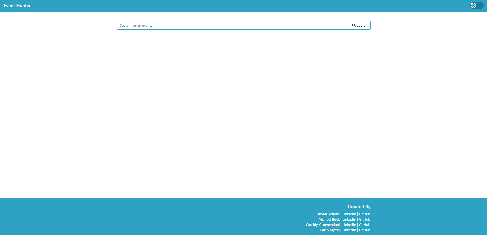
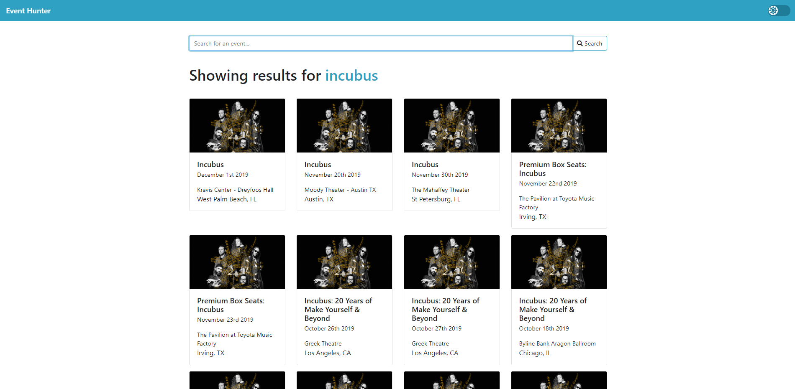
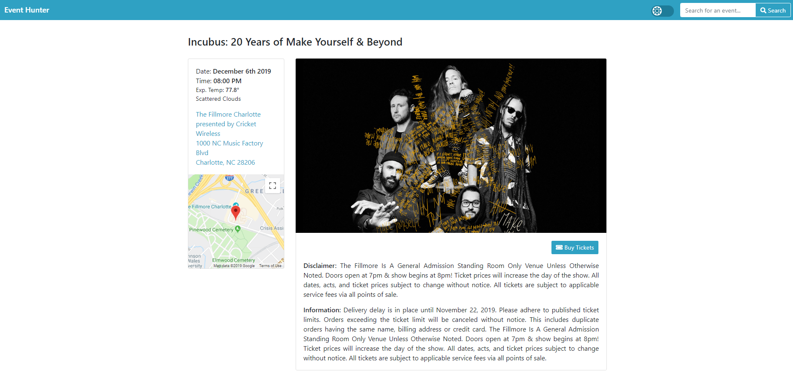
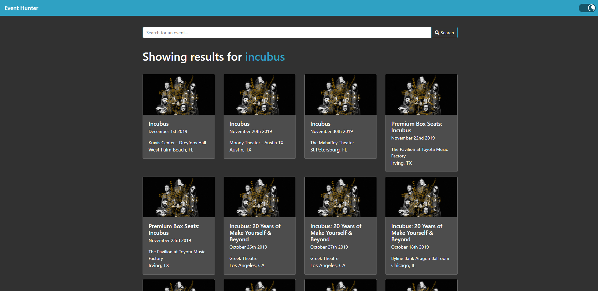

# Event Hunters

## Overview

Event Hunters is a site that allows users to search for events and find out details about them in one easy to use interface. Search queries interact with the TicketMaster API to utilize their database of events and gather relevant information.

## Details

The home page presents a search bar where the user can enter a term and press the `Search` button to bring up any matching events.

If there are any matching events, the first page of results will appear with a brief overview of the event. Scrolling to the bottom of the page brings up the next page of results, if available. All of the event cards are links to a page with more information.

After selecting an event, the user is brought to the details page where more information is presented.

Selecting the Sun/Moon slider on the navigation bar will toggle the page between light and dark mode.

